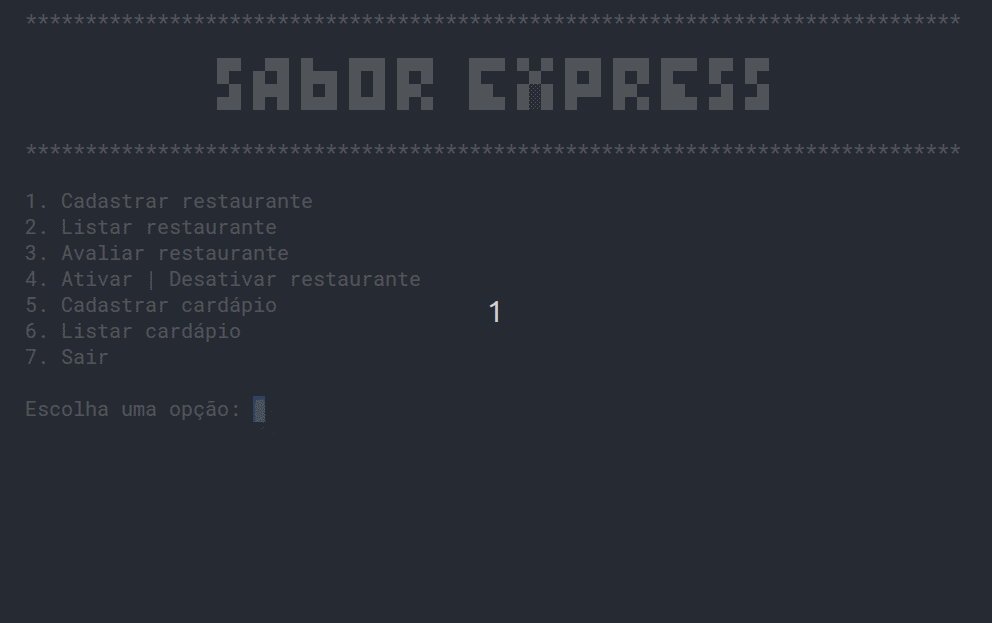

# Learning Python: Sabor Express

Aplicativo CLI desenvolvido durante as aulas de Python da [Alura]().

## Descrição

Sabor Express é um aplicativo CLI simples para cadastro de restaurantes. Entre outras funcionalidas está a listagem, avaliação e possibilidade ativar ou desativar restaurantes. Também está disponível um API para acesso aos dados dos restaurantes.

**Versões:**

* [v1.0.0](#v100)
* [v2.0.0](#v200)
* [v3.0.0](#v300)

## Pré-requisitos

* [venv](https://packaging.python.org/en/latest/guides/installing-using-pip-and-virtual-environments/)

## 🚀 Quick Start

```bash
# ativa ambiente virtual
source venv/bin/activate

# instala as dependências
pip install -r requirements.txt

# executa a aplicação
python app.py
```

<p align="center">
  
</p>

## ⚙️ API

```bash
# ativa ambiente virtual
source venv/bin/activate

# instala as dependências
pip install -r requirements.txt

# executa o servidor
uvicorn main:app --reload 
```

## 📖 Documentação da API

* [Sabor Express API](http://localhost:8000/docs#/)

## 🆕 Releases

### [v1.0.0](https://github.com/jeff-pedro/learn-python-sabor-express/tree/v1.0.0)

Essa versão inicial foi densenvolvida seguindo o paradigma funcional.

**Tópicos que foram estudados:**

1. uso da função `input()`
2. condifionais com `if-else`
3. loop com `for`
4. operações com listas `[]` e dicionários `{}`
5. casting de dados `int() float()`
6. tratamento de exceções com `try-except`
7. importação e uso de módulos
8. intereção com sistema operacional através do módulo `os`
9. expressões condicionais com operadores ternários: `True if condition else False`
10. **docstring** para documentações do código

**Funcionalidades:**

* Cadastrar restaurante.
* Listar restaurantes.
* Alternar estado do restaurante entre ativo e inativo.

### [v2.0.0](https://github.com/jeff-pedro/learn-python-sabor-express/tree/v2.0.0)

Nessa versão foi explorado o paradigma da Programação Orientada a Objetos. A implementação anterior baseada em funções foi convertida para uma implementação com classes.

**Tópicos que foram estudados:**

1. classes e objetos
2. método contrutor __init__
3. métodos especias com __str__ e __init__
4. decorators `@classmethod` e `@property`
5. abstração na maneira *pythonica*
6. importação de classes
7. associação entre classes
8. e outras técnicas e métodos...

**Novas funcionalidades:**

* Receber nota de avaliação do restaurante escolhido.
* Mostrar avalições ao listar os restaurantes.

### [v3.0.0](https://github.com/jeff-pedro/learn-python-sabor-express/tree/v3.0.0)

**Novas funcionalidades:**

* Adicionar cardápio aos restaurantes.
* Listar cardápio por restaurante.
* [Endpoint](localhost:8000/docs) para acessar API da aplicação.
* Melhoria na organização do código.

**Tópicos que foram estudados:**

* herança de classes
* uso do método especial `super()` para acessar métodos da classe herdada
* uso dos métodos `isinstance()` e `hasattr()`
* mais sobre `property` para leitura dado
* métodos abstrados através do decorator `@abstractmethod`
* aplicação do **polimorfismo**
* uso de ambiente vitualizado com `venv`
* documentar e compartilhar dependências com arquivos `requirements.txt`
* realizar *requisições http* com o módulo `requests`
* salvar dados em arquivos através do método `with open()`
* criação de API com **FastAPI**
* geração de documentação automatica através do *docs* e *redoc* do **Fast API**

## Estrutura do Projeto

Essa estrutura modulariza o código, separando responsabilidades e facilitando a manutenção e expansão do aplicativo.

```bash
sabor-express/
  ├── app.py
  ├── models/
  │   ├──__init__.py
  │   ├── avaliacao.py
  │   ├── cardapio
  │   │   ├── bebida.py
  │   │   ├── item_cardapio.py
  │   │   ├── prato.py
  │   │   └── sobremesa.py
  │   ├── menu.py
  │   └── restautante.py  
  ├── services/
  │   ├── __init__.py
  │   ├── restaurante_service.py
  │   └── cardapio_service.py
  └── ustils/
      ├── __init__.py
      └── display.py
```

* `app.py`: Ponto de entrada do aplicativo.
* `models/`: Contém as classes principais do modelo de dados.
  * `menu.py`: Classe Menu que gerencia a interface do usuário.
  * `restaurante.py`: Classe Restaurante que representa os dados e comportamentos de um restaurante.
  * `avaliacao.py`: Classe Restaurante que representa os dados e comportamentos de um restaurante.
  * `cardapio/`: Contém as classes que representa o cardápio de restaurantes.
    * `item_cardapio.py`: Classe ItemCardapio que representa os dados e comportamentos de um item do cardápio.
    * `prato.py`: Classe Prato que representa os dados e comportamentos de um prato.
    * `bebida.py`: Classe Bebida que representa os dados e comportamentos de uma bebida.
    * `sobremesa.py`: Classe Sobremesa que representa os dados e comportamentos de uma sobremesa.
* `services/`: Contém a lógica de negócios, separando a lógica de manipulação de dados das classes de modelo.
* `utils/`: Funções para manipulação de dados dos restaurantes.
  * `display.py`: Funções para exibição de mensagens e formatação de texto.

Cada pasta contém um arquivo `__init__.py` para indicar ao Python que o diretório deve ser tratado como um pacote. Isso permite a importação de módulos de dentro desses diretórios e pode conter código de inicialização para o pacote.
