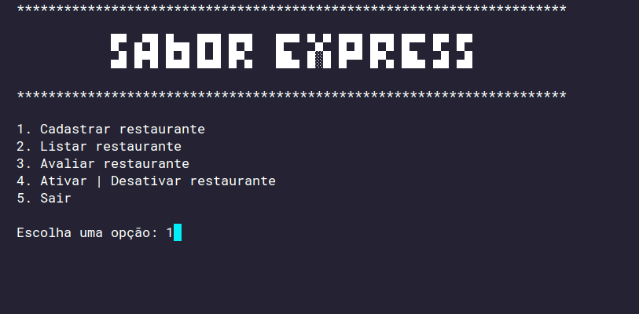

# Learning Python: Sabor Express

Aplicativo CLI desenvolvido durante as aulas de Python da [Alura]().

## Descrição

Sabor Express é um aplicativo CLI simples para cadastro de restaurantes. Entre outras funcionalidas está a listagem de restaurantes,alterar o estado de ativo ou inativo e sair do programa.

**Versões:**

* [v1.0.0](#v100)
* [v2.0.0](#v200)

## Pré-requisitos

* Python 3.12.0

## 🚀 Quick Start

```bash
python3 app.py
```

<p align="center">
  
</p>

## Releases

### [v1.0.0](https://github.com/jeff-pedro/learn-python-sabor-express/tree/v1.0.0)

Essa versão inicial foi densenvolvida seguindo o paradigma funcional.

#### Tópicos foram estudados:

1. uso da função `input()`
2. condifionais com `if-else`
3. loop com `for`
4. operações com listas `[]` e dicionários `{}`
5. casting de dados `int() float()`
6. tratamento de exceções com `try-except`
7. importação e uso de módulos
8. intereção com sistema operacional através do módulo `os`
9. expressões condicionais com operadores ternários: `True if condition else False`
10. **docstring** para documentações do código

### [v2.0.0](https://github.com/jeff-pedro/learn-python-sabor-express/tree/v2.0.0)

Nessa versão foi explorado o paradigma da Programação Orientada a Objetos. A implementação anterior baseada em funções foi convertida para uma implementação com classes.

#### Tópicos foram estudados:

1. classes e objetos
2. método contrutor __init__
3. métodos especias com __str__ e __init__
4. decorators `@classmethod` e `@property`
5. abstração de meneira *pythonica*
6. importação de classes
7. associação entre classes
8. entre outras técnicas e métodos...
